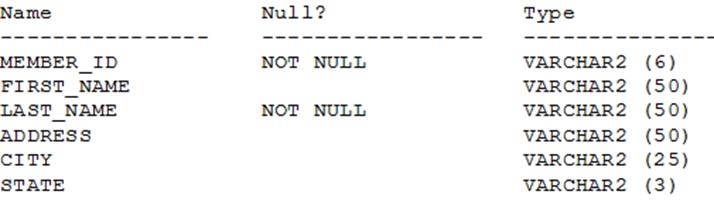
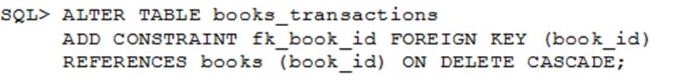

# Question #1
|Ingês|Português|
|-------------------------------------|----------------------------------|
|Evaluate the following SQL statement. Identify three ORDER BY clauses either one of which can complete the query.|Avalie a seguinte instrução SQL. Identifique três cláusulas ORDER BY, qualquer uma das quais pode ser concluída a pergunta.|

~~~sql
SELECT cust_id, cust_last_name "Last name"
FROM customers
WHERE country_id = 10 
UNION 
SELECT cust_id CUST_NO, cust_last_name
FROM customers 
WHERE country_id = 30 
~~~

**A. ORDER BY "Last name"**
**B. ORDER BY 2, cust_id**
C. ORDER BY CUST_NO
**D. ORDER BY 2, 1**
E. ORDER BY "CUST_NO"
 
 
> **Resposta correta: ABD**
> 
> Usando a cláusula ORDER BY em operações de conjunto
> * A cláusula ORDER BY pode aparecer apenas uma vez no final da consulta composta.
> * As consultas de componentes não podem ter cláusulas ORDER BY individuais.
>* A cláusula ORDER BY reconhece apenas as colunas da primeira consulta SELECT.
>* Por padrão, a primeira coluna da primeira consulta SELECT é usada para classificar a saída em ordem crescente.

# Question #2
|Ingês|Português|
|----------|----------|
|Which three statements are true regarding the WHERE and HAVING clauses in a SQL statement? (Choose three.)|Quais três afirmações são verdadeiras em relação às cláusulas WHERE e HAVING em uma instrução SQL? (Escolha três.)|
|A. WHERE and HAVING clauses cannot be used together in a SQL statement.|A. As cláusulas WHERE e HAVING não podem ser usadas juntas em uma instrução SQL.|
|**B. The HAVING clause conditions can have aggregate functions.**|**B. As condições da cláusula HAVING podem ter funções agregadas.**|
|C. The HAVING clause conditions can use aliases for the columns.|C. As condições da cláusula HAVING podem usar apelidos para as colunas.|
|**D. The WHERE clause is used to exclude rows before the grouping of data.**|**D A cláusula WHERE é usada para excluir linhas antes do agrupamento de dados.**|
|**E. The HAVING clause is used to exclude one or more aggregated results after grouping data**.|**E. A cláusula HAVING é usada para excluir um ou mais resultados agregados após agrupar dados.**|

> **Resposta correta: BDE**

# Question #3
|Ingês|Português|
|-------------------------------------|----------------------------------|
|Which statement is true regarding external tables?|Qual afirmação é verdadeira em relação às tabelas externas?|
|**A. The CREATE TABLE AS SELECT statement can be used to upload data into a normal table in the database from an external table.**|**A. A instrução CREATE TABLE AS SELECT pode ser usada para fazer upload de dados em uma tabela normal no banco de dados a partir de uma tabela externa.**|
|B. The data and metadata for an external table are stored outside the database.|B. Os dados e metadados de uma tabela externa são armazenados fora do banco de dados.|
|C. The default REJECT LIMIT for external tables is UNLIMITED.|C. O REJECT LIMIT padrão para tabelas externas é UNLIMITED.|
|D. ORACLE_LOADER and ORACLE_DATAPUMP have exactly the same functionality when used with an external table.|D. ORACLE_LOADER e ORACLE_DATAPUMP têm exatamente a mesma funcionalidade quando usados ​​com uma tabela externa.|

> **Resposta correta: A**  References: https://docs.oracle.com/cd/B28359_01/server.111/b28310/tables013.htm

# Question #4
|Ingês|Português|
|-------------------------------------|----------------------------------|
|Which two statements are true about Data Manipulation Language (DML) statements?|Quais são as duas afirmações são verdadeiras sobre as instruções da linguagem de manipulação de dados (DML)?|
|A. An INSERT INTO...VALUES.. statement can add multiple rows per execution to a table.|A. Uma instrução INSERT INTO ... VALUES .. pode adicionar várias linhas por execução a uma tabela.|
|**B. An UPDATE... SET... statement can modify multiple rows based on multiple conditions on a table.**|**B. Uma instrução UPDATE ... SET ... pode modificar várias linhas com base em várias condições em uma tabela.**|
|C. A DELETE FROM..... statement can remove rows based on only a single condition on a table.|C. Uma instrução DELETE FROM ..... pode remover linhas com base em apenas uma única condição em uma tabela.|
|D. An INSERT INTO... VALUES..... statement can add a single row based on multiple conditions on a table.|D. Uma instrução INSERT INTO ... VALUES ..... pode adicionar uma única linha com base em várias condições em uma tabela.|
|**E. A DELETE FROM..... statement can remove multiple rows based on multiple conditions on a table.**|**E. Uma instrução DELETE FROM ..... pode remover várias linhas com base em várias condições em uma tabela.**|
|F. An UPDATE....SET.... statement can modify multiple rows based on only a single condition on a table.|F. Uma instrução UPDATE .... SET .... pode modificar várias linhas com base em apenas uma única condição em uma tabela.|

> **Resposta correta: BE**  References: http://www.techonthenet.com/sql/and_or.php

# Question #5
|Ingês|Português|
|-------------------------------------|----------------------------------|
|Which two statements are true regarding roles? (Choose two.)|Quais são as duas afirmações são verdadeiras em relação as ROLES? (Escolha dois.)|
|A. A role can be granted to itself.|A. Uma ROLE pode ser concedida a si mesma.|
|**B. A role can be granted to PUBLIC.**|**B. Uma ROLE pode ser concedida a PUBLIC.**|
|C. A user can be granted only one role at any point of time.|C. Um usuário pode receber apenas uma função por vez.|
|D. The REVOKE command can be used to remove privileges but not roles from other users.|D. O comando REVOKE pode ser usado para remover privilégios, mas não ROLES de outros usuários.|
|**E. Roles are named groups of related privileges that can be granted to users or other roles.**|**E. ROLES são grupos nomeados de privilégios relacionados que podem ser concedidos a usuários ou outras roles.**|
 
> **Resposta correta: BE** References: http://docs.oracle.com/cd/E25054_01/network.1111/e16543/authorization.htm#autoId28

# Question #6
|Ingês|Português|
|-------------------------------------|----------------------------------|
|Which two statements are true regarding constraints? (Choose two)|Quais são as duas afirmações são verdadeiras em relação às restrições? (Escolha dois)|
|A. A constraint is enforced only for an INSERT operation on a table.|A. Uma restrição é aplicada apenas para uma operação INSERT em uma tabela.|
|B. A foreign key cannot contain NULL values.|B. Uma chave estrangeira não pode conter valores NULL.|
|**C. A column with the UNIQUE constraint can store NULLS.**|**C. Uma coluna com a restrição UNIQUE pode armazenar NULLS.**|
|**D. You can have more than one column in a table as part of a primary key.**|**D. Você pode ter mais de uma coluna em uma tabela como parte de uma chave primária.**|

> **Resposta correta: CD**

# Question #7
|Ingês|Português|
|-------------------------------------|----------------------------------|
|Evaluate the following statement.|Avalie a seguinte declaração.|

|Ingês|Português|
|-------------------------------------|----------------------------------|
|Which statement is true regarding the evaluation of rows returned by the subquery in the INSERT statement?|Qual afirmação é verdadeira em relação à avaliação das linhas retornadas pela subconsulta na instrução INSERT?|
|**A. They are evaluated by all the three WHEN clauses regardless of the results of the evaluation of any other WHEN clause.**|**A. Eles são avaliados por todas as três cláusulas WHEN, independentemente dos resultados da avaliação de qualquer outra cláusula WHEN.**|
|B. They are evaluated by the first WHEN clause. If the condition is true, then the row would be evaluated by the subsequent WHEN clauses.|B. Eles são avaliados pela primeira cláusula WHEN. Se a condição for verdadeira, a linha será avaliada pelas cláusulas WHEN subsequentes.|
|C. They are evaluated by the first WHEN clause. If the condition is false, then the row would be evaluated by the subsequent WHEN clauses.|C. Eles são avaliados pela primeira cláusula WHEN. Se a condição for falsa, a linha será avaliada pelas cláusulas WHEN subsequentes.|
|D. The insert statement would give an error because the ELSE clause is not present for support in case none of WHEN clauses are true.|D. A instrução insert daria um erro porque a cláusula ELSE não está presente para suporte no caso de nenhuma das cláusulas WHEN ser verdadeira.|
 
> **Resposta correta: A** References: http://psoug.org/definition/WHEN.htm

# Question #8
|Ingês|Português|
|-------------------------------------|----------------------------------|
|Examine the structure of the MEMBERS table:|Examine a estrutura da tabela MEMBROS:|

|Ingês|Português|
|-------------------------------------|----------------------------------|
|You want to display details of all members who reside in states starting with the letter A followed by exactly one character. Which SQL statement must you execute?|Você deseja exibir os detalhes de todos os membros que residem em estados que começam com a letra A seguida por exatamente um caractere. Qual instrução SQL você deve executar?|

* A. SELECT * FROM MEMBERS WHERE state LIKE '%A_';
* **B. SELECT * FROM MEMBERS WHERE state LIKE 'A_';**
* C. SELECT * FROM MEMBERS WHERE state LIKE 'A_%';
* D. SELECT * FROM MEMBERS WHERE state LIKE 'A%';
 
> **Resposta correta: B**

# Question #9
|Ingês|Português|
|--------------------------------|----------------------------------|
|You want to display 5 percent of the rows from the SALES table for products with the lowest AMOUNT_SOLD and also want to include the rows that have the same even if this causes the output to exceed 5 percent of the rows.|Você deseja exibir 5 por cento das linhas da tabela SALES para produtos com o menor AMOUNT_SOLD e também deseja incluir as linhas que têm o mesmo, mesmo que isso faça com que a saída exceda 5 por cento das linhas.|
|Which query will provide the required result?|Qual consulta fornecerá o resultado necessário?|

* **A. SELECT prod_id, cust_id, amount_sold FROM sales ORDER BY amount_sold FETCH FIRST 5 PERCENT ROWS WITH TIES;**
* B. SELECT prod_id, cust_id, amount_sold FROM sales ORDER BY amount_sold FETCH FIRST 5 PERCENT ROWS ONLY WITH TIES;
* C. SELECT prod_id, cust_id, amount_sold FROM sales ORDER BY amount_sold FETCH FIRST 5 PERCENT ROWS WITH TIES ONLY;
* D. SELECT prod_id, cust_id, amount_sold FROM sales ORDER BY amount_sold FETCH FIRST 5 PERCENT ROWS ONLY;
 
> **Resposta correta: A**

# Question #10
|Ingês|Português|
|-------------------------------------|----------------------------------|
|Examine the structure of the MEMBERS table:|Examine a estrutura da tabela MEMBERS:|

~~~sql
Name Null? Type
------------------ --------------- ------------------------------
MEMBER_ID NOT NULL VARCHAR2 (6)
FIRST_NAME VARCHAR2 (50)
LAST_NAME NOT NULL VARCHAR2 (50)
ADDRESS VARCHAR2 (50)
~~~

|Ingês|Português|
|-------------------------------------|----------------------------------|
You execute the SQL statement:|Você executa a instrução:|

~~~sql
SQL > SELECT member_id, ' ' , first_name, ' ' , last_name "ID FIRSTNAME LASTNAME " FROM members ´
~~~

|Ingês|Português|
|-------------------------------------|----------------------------------|
|What is the outcome?|Qual é o resultado?|
|A. It fails because the alias name specified after the column names is invalid.|A. Ele falha porque o nome alternativo especificado após os nomes das colunas é inválido.|
|B. It fails because the space specified in single quotation marks after the first two column names is invalid.|B. Ele falha porque o espaço especificado entre aspas simples após os dois primeiros nomes de coluna é inválido.|
|C. It executes successfully and displays the column details in a single column with only the alias column heading.|C. Ele é executado com sucesso e exibe os detalhes da coluna em uma única coluna com apenas o título da coluna de alias.|
|**D. It executes successfully and displays the column details in three separate columns and replaces only the last column heading with the alias.**|**D. É executado com sucesso e exibe os detalhes da coluna em três colunas separadas e substitui apenas o título da última coluna com o alias.**| 
> **Resposta correta: D**

# Question #11
|Ingês|Português|
|--------------------------------|----------------------------------|
|You issue the following command to drop the PRODUCTS table:|Você emite o seguinte comando para eliminar a tabela PRODUCTS:|

~~~sql
SQL > DROP TABLE products;
~~~

|Ingês|Português|
|--------------------------------|----------------------------------|
|Which three statements are true about the implication of this command? (Choose three.)|Quais são as três afirmações são verdadeiras sobre a implicação desse comando? (Escolha três.)|
|**A. All data along with the table structure is deleted.**                                |**A. Todos os dados junto com a estrutura da tabela são excluídos.**|
|**B. A pending transaction in the session is committed.**                                 |**B. Uma transação pendente na sessão é confirmada.**|
|C. All indexes on the table remain but they are invalidated.                          |C. Todos os índices na tabela permanecem, mas são invalidados.|
|**D. All views and synonyms on the table remain but they are invalidated.**               |**D. Todas as visualizações e sinônimos na tabela permanecem, mas são invalidados.**|
|E. All data in the table is deleted but the table structure remains.                  |E. Todos os dados da tabela são excluídos, mas a estrutura da tabela permanece.|
 
> **Correct Answer: ABD**

# Question #12
You execute the following commands:

~~~sql
SQL > DEFINE hiredate = '01-APR-2011'
SQL >SELECT employee_id, first_name, salary
FROM employees -
WHERE hire_date > '&hiredate'
AND manager_id > &mgr_id;
~~~

|Ingês|Português|
|--------------------------------|----------------------------------|
|For which substitution variables are you prompted for the input?|Para quais variáveis ​​de substituição é solicitada a entrada?|
|A. none, because no input required                              |A. nenhum, porque nenhuma entrada necessária|
|B. both the substitution variables 'hiredate' and 'mgr_id'.    |B. ambas as variáveis ​​de substituição ' hiredate 'e' mgr_id '.|
|C. only 'hiredate'|C. apenas 'hiredate|
|**D. only 'mgr_id'**                                            |**D. apenas 'mgr_id'**|
 
> **Correct Answer: D** 

# Question #13
|Ingês|Português|
|--------------------------------|----------------------------------|
|View the Exhibit and examine the structure of ORDERS and ORDER_ITEMS tables. is the primary key in the ORDERS table. It is also the foreign key in the ORDER_ITEMS table wherein it is created with the ON DELETE CASCADE option.|Visualize a Exposição e examine a estrutura das tabelas ORDERS e ORDER_ITEMS. é a chave primária na tabela ORDERS. É também a chave estrangeira na tabela ORDER_ITEMS onde é criada com a opção ON DELETE CASCADE.|

|Ingês|Português|
|--------------------------------|----------------------------------|
|Which DELETE statement would execute successfully?|Qual instrução DELETE seria executada com sucesso?|

* A. DELETE orders o, order_items i WHERE o.order_id = i.order_id;
* B. DELETE FROM orders WHERE (SELECT order_id FROM order_items);
* **C. DELETE orders WHERE order_total < 1000;**
* D. DELETE order_id FROM orders WHERE order_total < 1000;
 
> **Correct Answer: C** 

# Question #14
|Ingês|Português|
|--------------------------------|----------------------------------|
|View the Exhibit and examine the structure of CUSTOMERS table.|Veja a Exposição e examine a estrutura da tabela CUSTOMERS.|

|Ingês|Português|
|--------------------------------|----------------------------------|
|Using the CUSTOMERS table, you need to generate a report that shows an increase in the credit limit by 15% for all customers. Customers whose credit limit has not been entered should have the message "Not Available" displayed.|Usando a tabela CUSTOMERS, é necessário gerar um relatório que mostre um aumento no limite de crédito em 15% para todos os clientes. Os clientes cujo limite de crédito não foi inserido devem ter a mensagem "Not Available" exibida.|
|Which SQL statement would produce the required result?|Qual instrução SQL produziria o resultado necessário?|

* **A. SELECT NVL (TO CHAR(cust_credit_limit * .15), 'Not Available') "NEW CREDIT" FROM customers;**
* B. SELECT TO_CHAR (NVL(cust_credit_limit * .15), 'Not Available') "NEW CREDIT" FROM customers;
* C. SELECT NVL(cust_credit_limit * .15), 'Not Available') "NEW CREDIT" FROM customers;
* D. SELECT NVL(cust_credit_limit), 'Not Available') "NEW CREDIT" FROM customers;
 
> **Correct Answer: A** 

# Question #15
|Ingês|Português|
|--------------------------------|----------------------------------|
|View the exhibit and examine the structures of the EMPLOYEES and DEPARTMENTS tables.|Veja a exposição e examine as estruturas das tabelas EMPLOYEES e DEPARTMENTS.|

|Ingês|Português|
|--------------------------------|----------------------------------|
|You want to update EMPLOYEES table as follows:|Você deseja atualizar a tabela EMPLOYEES da seguinte forma:|
|✑ Update only those employees who work in Boston or Seattle (locations 2900 and 2700).                      |✑ Atualize apenas os funcionários que trabalham em Boston ou Seattle (locais 2900 e 2700).|   
|✑ Set department_id for these employees to the department_id corresponding to London (location_id 2100).    |✑ Defina o department_id para esses funcionários como o department_id correspondente a Londres (location_id 2100).|
|✑ Set the employees' salary in location_id 2100 to 1.1 times the average salary of their department.        |✑ Defina o salário dos funcionários em location_id 2100 para 1,1 vezes o salário médio de seu departamento.|
|✑ Set the employees' commission in location_id 2100 to 1.5 times the average commission of their department.|✑ Defina a comissão dos funcionários em location_id 2100 para 1,5 vezes a comissão média de seu departamento.|
|You issue the following command:|Você emite o seguinte comando:|

|Ingês|Português|
|--------------------------------|----------------------------------|
|What is outcome?|Qual é o resultado?|
|A. It generates an error because multiple columns (SALARY, COMMISSION) cannot be specified together in an UPDATE statement.|A. Ele gera um erro porque várias colunas (SALÁRIO, COMISSÃO) não podem ser especificadas juntas em uma instrução UPDATE.|
|B. It generates an error because a subquery cannot have a join condition in a UPDATE statement.|B. Isso gera um erro porque uma subconsulta não pode ter uma condição de junção em uma instrução UPDATE.|
|C. It executes successfully and gives the desired update|C. É executado com sucesso e fornece a atualização desejada|
|**D. It executes successfully but does not give the desired update**|**D. É executado com sucesso, mas não fornece a atualização desejada**|
 
> **Correct Answer: D** 

# Question #16
|Ingês|Português|
|--------------------------------|----------------------------------|
|Evaluate the following two queries:|Avalie as duas consultas a seguir:|

|Ingês|Português|
|--------------------------------|----------------------------------|
|Which statement is true regarding the above two queries?|Qual afirmação é verdadeira em relação às duas consultas acima?|
|A. Performance would improve in query 2 only if there are null values in the CUST_CREDIT_LIMIT column.|A. O desempenho melhoraria na consulta 2 apenas se houver valores nulos na coluna CUST_CREDIT_LIMIT.|
|**B. There would be no change in performance.**|**B. Não haveria mudança no desempenho.**|
|C. Performance would degrade in query 2.|C. O desempenho diminuiria na consulta 2.|
|D. Performance would improve in query 2.|D. O desempenho melhoraria na consulta 2.|
 
> **Correct Answer: B** 

# Question #17
|Ingês|Português|
|--------------------------------|----------------------------------|
|Examine the business rule:|Examine a regra de negócios:|
|Each student can work on multiple projects and each project can have multiple students.|Cada aluno pode trabalhar em vários projetos e cada projeto pode ter vários alunos.|
|You need to design an Entity Relationship Model (ERD) for optimal data storage and allow for generating reports in this format:|Você precisa projetar um modelo de relacionamento de entidade (ERD) para armazenamento de dados ideal e permitir a geração de relatórios neste formato:|

`STUDENT_ID FIRST_NAME LAST_NAME PROJECT_ID PROJECT_NAME PROJECT_TASK`

|Ingês|Português|
|--------------------------------|----------------------------------|
|Which two statements are true in this scenario? (Choose two.)|Quais duas afirmações são verdadeiras neste cenário? (Escolha dois.)|
|A. The ERD must have a 1:M relationship between the STUDENTS and PROJECTS entities.|A. O ERD deve ter uma relação 1: M entre as entidades ALUNOS e PROJETOS.|
|**B. The ERD must have a M:M relationship between the STUDENTS and PROJECTS entities that must be resolved into 1:M relationships.**|**B. O ERD deve ter um relacionamento M: M entre as entidades ALUNOS e PROJETOS que deve ser resolvido em relacionamentos 1: M.**|
|C. STUDENT_ID must be the primary key in the STUDENTS entity and foreign key in the PROJECTS entity.|C. STUDENT_ID deve ser a chave primária na entidade STUDENTS e a chave estrangeira na entidade PROJECTS.|
|D. PROJECT_ID must be the primary key in the PROJECTS entity and foreign key in the STUDENTS entity.|D. PROJECT_ID deve ser a chave primária na entidade PROJECTS e a chave estrangeira na entidade STUDENTS.|
|**E. An associative table must be created with a composite key of STUDENT_ID and PROJECT_ID, which is the foreign key linked to the STUDENTS and entities. PROJECTS**|**E. Uma tabela associativa deve ser criada com uma chave composta de STUDENT_ID e PROJECT_ID, que é a chave estrangeira vinculada aos ALUNOS e entidades. PROJETOS**|
 
> **Correct Answer: BE**  References: http://www.oracle.com/technetwork/issue-archive/2011/11-nov/o61sql-512018.html

# Question #18
|Ingês|Português|
|--------------------------------|----------------------------------|
|View the Exhibit and examine the details of PRODUCT_INFORMATION table.|Visualize a Exposição e examine os detalhes da tabela PRODUCT_INFORMATION.|

|Ingês|Português|
|--------------------------------|----------------------------------|
|You have the requirement to display PRODUCT_NAME from the table where the CATEGORY_ID column has values 12 or 13, and the SUPPLIER_ID column has the value 102088. You executed the following SQL statement:|Você tem o requisito de exibir PRODUCT_NAME da tabela em que a coluna CATEGORY_ID tem os valores 12 ou 13 e a coluna SUPPLIER_ID tem o valor 102088. Você executou a seguinte instrução SQL:|

~~~sql
SELECT product_name -

FROM product_information -
WHERE (category_id = 12 AND category_id = 13) AND supplier_id = 102088;
~~~

|Ingês|Português|
|--------------------------------|----------------------------------|
|Which statement is true regarding the execution of the query?|Qual afirmação é verdadeira em relação à execução da consulta?|
|A. It would not execute because the same column has been used in both sides of the AND logical operator to form the condition.|A. Ele não seria executado porque a mesma coluna foi usada em ambos os lados do operador lógico AND para formar a condição.|
|B. It would not execute because the entire WHERE clause condition is not enclosed within the parentheses.|B. Não seria executado porque toda a condição da cláusula WHERE não está entre parênteses.|
|C. It would execute and the output would display the desired result.|C. Ele seria executado e a saída exibiria o resultado desejado.|
|**D. It would execute but the output would return no rows.**|**D. Ele seria executado, mas a saída não retornaria nenhuma linha.**|
 
> **Correct Answer: D** 

# Question #19
|Ingês|Português|
|--------------------------------|----------------------------------|
|Which two statements are true regarding the EXISTS operator used in the correlated subqueries? (Choose two.)|Quais são as duas afirmações são verdadeiras em relação ao operador EXISTS usado nas subconsultas correlacionadas? (Escolha dois.)|
|**A. The outer query stops evaluating the result set of the inner query when the first value is found.**|**A. A consulta externa para de avaliar o conjunto de resultados da consulta interna quando o primeiro valor é encontrado.**|
|B. It is used to test whether the values retrieved by the inner query exist in the result of the outer query.|B. É usado para testar se os valores recuperados pela consulta interna existem no resultado da consulta externa.|
|**C. It is used to test whether the values retrieved by the outer query exist in the result set of the inner query.**|**C. É usado para testar se os valores recuperados pela consulta externa existem no conjunto de resultados da consulta interna.**|
|D. The outer query continues evaluating the result set of the inner query until all the values in the result set are processed.|D. A consulta externa continua avaliando o conjunto de resultados da consulta interna até que todos os valores no conjunto de resultados sejam processados.|
 
> **Resposta correta: AC** Referências: http://www.techonthenet.com/oracle/exists.php
 
# Question #20
|Ingês|Português|
|--------------------------------|----------------------------------|
|View the exhibit and examine the structure of the STORES table.|Veja a exposição e examine a estrutura da mesa STORES.|

|Ingês|Português|
|--------------------------------|----------------------------------|
|You must display the NAME of stores along with the ADDRESS, START_DATE, PROPERTY_PRICE, and the projected property price, which is 115% of property price.|Você deve exibir o NOME das lojas junto com ADDRESS, START_DATE, PROPERTY_PRICE e o preço projetado da propriedade, que é 115% do preço da propriedade.|
|The stores displayed must have START_DATE in the range of 36 months starting from 01-Jan-2000 and above.|As lojas exibidas devem ter START_DATE no intervalo de 36 meses a partir de 01 de janeiro de 2000 e acima.|
|Which SQL statement would get the desired output?|Qual instrução SQL obteria a saída desejada?|

* A. SELECT name, concat (address| | ','| |city| |', ', country) AS full_address, start_date, property_price, property_price*115/100 FROM stores WHERE MONTHS_BETWEEN (start_date, '01-JAN-2000') <=36;
* B. SELECT name, concat (address| | ','| |city| |', ', country) AS full_address, start_date, property_price, property_price*115/100 FROM stores WHERE TO_NUMBER(start_date-TO_DATE('01-JAN-2000','DD-MON-RRRR')) <=36;
* C. SELECT name, address||', '||city||', '||country AS full_address, start_date, property_price, property_price*115/100 FROM stores WHERE MONTHS_BETWEEN(start_date,TO_DATE('01-JAN-2000','DD-MON-RRRR')) <=36;
* **D. SELECT name, concat (address||','| |city| |', ', country) AS full_address, start_date, property_price, property_price*115/100 FROM stores WHERE MONTHS_BETWEEN (start_date, TO_DATE('01-JAN-2000','DD-MON-RRRR')) <=36;**
 
> **Correct Answer: D**

# Question #21
|Ingês|Português|
|--------------------------------|----------------------------------|
|The BOOKS_TRANSACTIONS table exists in your database.|A tabela BOOKS_TRANSACTIONS existe em seu banco de dados.|
~~~sql
SQL>SELECT * FROM books_transactions ORDER BY 3;
~~~
|Ingês|Português|
|--------------------------------|----------------------------------|
|What is the outcome on execution?|Qual é o resultado da execução?|
|A. The execution fails unless the numeral 3 in the ORDER BY clause is replaced by a column name.|A. A execução falha a menos que o numeral 3 na cláusula ORDER BY seja substituído por um nome de coluna.|
|B. Rows are displayed in the order that they are stored in the table only for the three rows with the lowest values in the key column.|B. As linhas são exibidas na ordem em que são armazenadas na tabela apenas para as três linhas com os valores mais baixos na coluna-chave.|
|C. Rows are displayed in the order that they are stored in the table only for the first three rows.|C. As linhas são exibidas na ordem em que são armazenadas na tabela apenas para as três primeiras linhas.|
|**D. Rows are displayed sorted in ascending order of the values in the third column in the table.**|**D. As linhas são exibidas classificadas em ordem crescente dos valores na terceira coluna da tabela.**|
 
> **Correct Answer: D** 

# Question #22
|Ingês|Português|
|--------------------------------|----------------------------------|
|Examine the command:|Examine o comando:|

|Ingês|Português|
|--------------------------------|----------------------------------|
|What does ON DELETE CASCADE imply?|O que significa ON DELETE CASCADE?|
|A. When the BOOKS table is dropped, the BOOK_TRANSACTIONS table is dropped.|A. Quando a tabela BOOKS é eliminada, a tabela BOOK_TRANSACTIONS é eliminada.|
|B. When the BOOKS table is dropped, all the rows in the BOOK_TRANSACTIONS table are deleted but the table structure is retained.|B. Quando a tabela BOOKS é eliminada, todas as linhas na tabela BOOK_TRANSACTIONS são excluídas, mas a estrutura da tabela é mantida.|
|**C. When a row in the BOOKS table is deleted, the rows in the BOOK_TRANSACTIONS table whose BOOK_ID matches that of the deleted row in the BOOKS table are also deleted.**|**C. Quando uma linha na tabela BOOKS é excluída, as linhas na tabela BOOK_TRANSACTIONS cujo BOOK_ID corresponde ao da linha excluída na tabela BOOKS também são excluídas.**|
|D. When a value in the BOOKS.BOOK_ID column is deleted, the corresponding value is updated in the BOOKS_TRANSACTIONS.BOOK_ID column.|D. Quando um valor na coluna BOOKS.BOOK_ID é excluído, o valor correspondente é atualizado na coluna BOOKS_TRANSACTIONS.BOOK_ID.|
 
> **Correct Answer: C** 

# Question #23
|Ingês|Português|
|--------------------------------|----------------------------------|
|View the exhibit and examine the structure of the EMPLOYEES table.|Veja a exposição e examine a estrutura da tabela EMPLOYEES.|

|Ingês|Português|
|--------------------------------|----------------------------------|
|You want to display all employees and their managers having 100 as the MANAGER_ID. You want the output in two columns: the first column would have the of the managers and the second column would have LAST_NAME of the employees.|Você deseja exibir todos os funcionários e seus gerentes com 100 como MANAGER_ID. Você quer a saída em duas colunas: a primeira coluna teria o dos gerentes e a segunda coluna teria LAST_NAME dos funcionários.|
|Which SQL statement would you execute?|Qual instrução SQL você executaria?|

* A. SELECT m.last_name "Manager", e.last_name "Employee" FROM employees m JOIN employees e ON m.employee_id = e.manager_id WHERE m.manager_id = 100;
* **B. SELECT m.last_name "Manager", e.last_name "Employee" FROM employees m JOIN employees e ON m.employee_id = e.manager_id WHERE e.manager_id = 100;**
* C. SELECT m.last_name "Manager", e.last_name "Employee" FROM employees m JOIN employees e ON e.employee_id = m.manager_id WHERE m.manager_id = 100;
* D. SELECT m.last_name "Manager", e.last_name "Employee" FROM employees m JOIN employees e WHERE m.employee_id = e.manager_id AND e.manager_id = 100
 
> **Correct Answer: B** 

# Question #24
|Ingês|Português|
|--------------------------------|----------------------------------|
|Which three statements are true about multiple-row subqueries?|Quais três afirmações são verdadeiras sobre subconsultas de várias linhas?|
|**A. They can contain a subquery within a subquery.**|**A. Eles podem conter uma subconsulta dentro de uma subconsulta.**|
|**B. They can return multiple columns as well as rows.**|**B. Eles podem retornar várias colunas, bem como linhas.**|
|C. They cannot contain a subquery within a subquery.|C. Eles não podem conter uma subconsulta dentro de uma subconsulta.|
|D. They can return only one column but multiple rows.|D. Eles podem retornar apenas uma coluna, mas várias linhas.|
|**E. They can contain group functions and GROUP BY and HAVING clauses.**|**E. Eles podem conter funções de grupo e cláusulas GROUP BY e HAVING.**|
|F. They can contain group functions and the GROUP BY clause, but not the HAVING clause.|F. Eles podem conter funções de grupo e a cláusula GROUP BY, mas não a cláusula HAVING.|
 
> **Correct Answer: ABE** 

# Question #25
|Ingês|Português|
|--------------------------------|----------------------------------|
|Examine the structure of the EMPLOYEES table.|Examine a estrutura da tabela EMPLOYEES.|

|Ingês|Português|
|--------------------------------|----------------------------------|
|There is a parent/child relationship between EMPLOYEE_ID and MANAGER_ID.|Existe uma relação pai / filho entre EMPLOYEE_ID e MANAGER_ID.|
|You want to display the last names and manager IDs of employees who work for the same manager as the employee whose EMPLOYEE_ID is 123.|Você deseja exibir os sobrenomes e IDs de gerente dos funcionários que trabalham para o mesmo gerente que o funcionário cujo EMPLOYEE_ID é 123.|
|Which query provides the correct output?|Qual consulta fornece a saída correta?|
* A. SELECT e.last_name, m.manager_id FROM employees e RIGHT OUTER JOIN employees m on (e.manager_id = m.employee_id) AND e.employee_id = 123;
* B. SELECT e.last_name, m.manager_id FROM employees e LEFT OUTER JOIN employees m on (e.employee_id = m.manager_id) WHERE e.employee_id = 123;
* C. SELECT e.last_name, e.manager_id FROM employees e RIGHT OUTER JOIN employees m on (e.employee_id = m.employee_id) WHERE e.employee_id = 123;
* **D. SELECT m.last_name, e.manager_id FROM employees e LEFT OUTER JOIN employees m on (e.manager_id = m.manager_id) WHERE e.employee_id = 123;**
 
> **Correct Answer: D** 

# Question #26
|Ingês|Português|
|--------------------------------|----------------------------------|
|Which normal form is a table in if it has no multi-valued attributes and no partial dependencies?|Em qual forma normal é uma tabela se ela não tem atributos com vários valores e nenhuma dependência parcial?|
|**A. Second normal form**|**A. Segunda forma normal**|
|B. First normal form|B. Primeira forma normal|
|C. Third normal form|C. Terceira forma normal|
|D. Fourth normal form|D. Quarta forma normal|
 
> **Correct Answer: A** References: https://blog.udemy.com/database-normal-forms/

# Question #27
|Ingês|Português|
|--------------------------------|----------------------------------|
|Sales data of a company is stored in two tables, SALES1 and SALES2, with some data being duplicated across the tables. You want to display the results from the table, which are not present in the SALES2 table.|Os dados de vendas de uma empresa são armazenados em duas tabelas, SALES1 e SALES2, com alguns dados sendo duplicados nas tabelas. Você deseja exibir os resultados da tabela, que não estão presentes na tabela SALES2.|

|Ingês|Português|
|--------------------------------|----------------------------------|
|Which set operator generates the required output?|Qual operador de conjunto gera a saída necessária?|
* A. INTERSECT
* B. UNION
* C. PLUS
* **D. MINUS**
* E. SUBTRACT
 
> **Correct Answer: D** References: https://docs.oracle.com/cd/B19306_01/server.102/b14200/queries004.htm

# Question #28
|Ingês|Português|
|--------------------------------|----------------------------------|
|Evaluate the following ALTER TABLE statement:|Avalie a seguinte instrução ALTER TABLE:|
~~~sql
ALTER TABLE orders - SET UNUSED (order_date);
~~~
|Ingês|Português|
|--------------------------------|----------------------------------|
|Which statement is true?|Qual afirmação é verdadeira?|
|**A. After executing the ALTER TABLE command, you can add a new column called ORDER_DATE to the ORDERS table.**|**A. Depois de executar o comando ALTER TABLE, você pode adicionar uma nova coluna chamada ORDER_DATE à tabela ORDERS.**|
|B. The ORDER_DATE column must be empty for the ALTER TABLE command to execute successfully.|B. A coluna ORDER_DATE deve estar vazia para que o comando ALTER TABLE seja executado com sucesso.|
|C. ROLLBACK can be used to get back the ORDER_DATE column in the ORDERS table.|C. ROLLBACK pode ser usado para retornar a coluna ORDER_DATE na tabela ORDERS.|
|D. The DESCRIBE command would still display the ORDER_DATE column.|D. O comando DESCRIBE ainda exibiria a coluna ORDER_DATE.|
 
> **Correct Answer: A** 

# Question #29
|Ingês|Português|
|--------------------------------|----------------------------------|
|Evaluate the following SQL statements that are issued in the given order:|Avalie as seguintes instruções SQL que são emitidas na ordem dada:|
~~~sql
CREATE TABLE emp -
(emp_no NUMBER(2) CONSTRAINT emp_emp_no_pk PRIMARY KEY,
ename VARCHAR2(15),
salary NUMBER (8,2),
mgr_no NUMBER(2) CONSTRAINT emp_mgr_fk REFERENCES emp(emp_no));

ALTER TABLE emp -
DISABLE CONSTRAINT emp_emp_no_pk CASCADE;

ALTER TABLE emp -
ENABLE CONSTRAINT emp_emp_no_pk;
~~~
|Ingês|Português|
|--------------------------------|----------------------------------|
|What would be the status of the foreign key EMP_MGR_PK?|Qual seria o status da chave estrangeira EMP_MGR_PK?|
|A. It would remain disabled and can be enabled only by dropping the foreign key constraint and recreating it.|A. Ele permaneceria desabilitado e só pode ser habilitado eliminando a restrição de chave estrangeira e recriando-a.|
|**B. It would remain disabled and has to be enabled manually using the ALTER TABLE command.**|**B. Ele permaneceria desativado e deve ser ativado manualmente usando o comando ALTER TABLE.**|
|C. It would be automatically enabled and immediate.|C. Seria ativado automaticamente e imediato.|
|D. It would be automatically enabled and deferred.|D. Ele seria ativado automaticamente e adiado.|
 
> **Correct Answer: B** 

# Question #30
|Ingês|Português|
|--------------------------------|----------------------------------|
|Which three statements are true regarding the data types? (Choose three.)|Quais são as três afirmações são verdadeiras em relação aos tipos de dados? (Escolha três.)|
|**A. The minimum column width that can be specified for a VARCHAR2 data type column is one.**|**A. A largura mínima da coluna que pode ser especificada para uma coluna do tipo de dados VARCHAR2 é um.**|
|**B. Only one LONG column can be used per table.**|**B. Apenas uma coluna LONG pode ser usada por tabela.**|
|C. A TIMESTAMP data type column stores only time values with fractional seconds.|C. Uma coluna de tipo de dados TIMESTAMP armazena apenas valores de tempo com segundos fracionários.|
|D. The BLOB data type column is used to store binary data in an operating system file.|D. A coluna de tipo de dados BLOB é usada para armazenar dados binários em um arquivo do sistema operacional.|
|**E. The value for a CHAR data type column is blank-padded to the maximum defined column width.**|**E. O valor para uma coluna de tipo de dados CHAR é preenchido em branco até a largura de coluna máxima definida.**|
 
> **Correct Answer: ABE** 